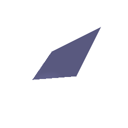

# Rendering Basics with PyTorch3D

You can run all files using:
`python main.py`

### 0.1 Rendering your first mesh

 If you run `python -m q0 --image_size 256 --output_path images/q0/cow_render.jpg`, you should see
the following output:

## 1. Practicing with Cameras

### 1.1. 360-degree Renders

If you run `python -m src.q1_1 --image_size 256 --output_path images/q1/cow_render.gif`, you should see
the following output:

### 1.2 Re-creating the Dolly Zoom

If you run `python -m src.q1_2 --num_frames 10 --image_size 256 --output_file images/q1/dolly_gif.gif`, you should see
the following output:

## 2. Practicing with Meshes

### 2.1 Constructing a Tetrahedron

Number of vertices = 4
Number of faces = 4

If you run `python -m src.q2_1 --image_size 256 --output_path images/q2/tetrahedron_render.gif`, you should see
the following output:

### 2.2 Constructing a Cube

Number of vertices = 8
Number of faces = 12 (2 triangular meshes for each side)

If you run `python -m src.q2_2 --image_size 256 --output_path images/q2/cube_render.gif`, you should see
the following output:

## 3. Re-texturing a mesh

`color1 = [0,0,1] (blue) and color2=[1,0,0] (red)`

If you run `python -m src.q3 --image_size 256 --output_path images/q3/cow_texture.gif`, you should see
the following output:

## 4. Camera Transformations

**Relative Rotation and Relative Transalation:** 

Say, a camera is moving in a fixed environment. The environment is represented by the world coordinate system. 
The camera has its own coordinate system at each of its position. This system has its origin at the camera centre 
i.e. the origin keeps moving. 
Now, we are interested in defining the relationship between the camera coordinate systems observed in position 1 and position 2.
Relative rotation and relative translation define this relationship. 

**Relative rotation** describes the amount of rotation the camera must undergo(from position 1) such that the axes of the camera
in position 1 aligns with the axes in position 2. Mathematically, R2 = R_relative @ R1

**Relative translation** is similary described as the amount of translation the camera must undergo(from position 1) for its centre
in position 1 to align with the centre in position 2. Mathematically, T2 = T_relative @ T1

Please note: Pytorch3D accepts the transpose of what has been described as the relative rotation and translation above.

If you run `python -m src.q4 --image_size 512 --output_path images/q4/camera_1.jpg images/q4/camera_2.jpg images/q4/camera_3.jpg images/q4/camera_4.
jpg`, you should see
the following output:

`R_rel = [[0,1,0],[-1,0,0],[0,0,1]]
T_rel = [0,0,0]`

`The relative rotation sets the new X axis --> old Y axis and new Y axis --> negative of old X axis.
The relative translation is zero as camera merely rotates in its position`

`R_rel = [[0,0,1],[0,1,0],[0,0,1]]
T_rel = [0,0,3]`

`The relative rotation is identity (actually, the transpose of it) i.e. has no effect on the original rotation of the camera. 
The relative translation moves the object away by 3 units along the positve z direction.`

`R_rel = [[0,0,1],[0,1,0],[0,0,1]]
T_rel = [0.5,-0.5,0]`

`The relative translation moves the new camera coordinates to (-0.5, 0.5) which is equivalent to the object moving diagonally towards bottom left 
corner. The rotation matrix remains unchanged`

`R_rel = [[0.,0.,1],[0,1,0],[-1.,0,0]]
T_rel = [-3,0,3]`

`The relative rotation sets the new X-axis --> old Z-axis and the new Z-axis --> old negative X-axis.
The relative translation moves the the camera origin diagonally in the X-Z plane.`

## 5. Rendering Generic 3D Representations

### 5.1 Rendering Point Clouds from RGB-D Images

If you run `python -m src.q5_1 --render point_cloud --image_size 256 --output_path images/q5/plants1.gif images/q5/plants2.gif images/q5/plants3.
gif`, you should see
the following output:

### 5.2 Parametric Functions

If you run `python -m src.q5_2 --render parametric --num_samples 100 1000 --image_size 256 --output_path images/q5/`, you should see
the following output:

 100 samples

1000 samples

### 5.3 Implicit Surfaces

**Memory Efficiency:** Meshes are less memory efficient as they require storing face representations in addition to vertices.
**Rendering Speed:** Points clouds are easier/faster to render as they don't require rendering the surface between the points.
**Rendering Quality:** Given we use sufficient number of faces, mesh will provide a better visually quality as it allows for
observing surfaces. It is easier to reason about the shape because of the connectivity. Points clouds may not be able to
accurately represent fine details of an object (e.g. horn of the cow )

If you run `python -m src.q5_3 --render implicit --num_samples 100 --image_size 256 --output_path images/q5/torus_implicit.gif`, you 
should see the following output:

## 6. Do Something Fun

Nothing fancy here, just a parametric rendering of a spiral spiralling.

If you run `python -m src.q6 --render parametric --num_samples 100 --image_size 256 --output_path images/q6/spiral_parametric.gif`, you 
should see the following output:

## (Extra Credit) 7. Sampling Points on Meshes

If you run `python -m src.q7 --image_size 256 --output_path images/q7/`, you 
should see the following output:

10 samples

100 samples

1000 samples

10000 samples

