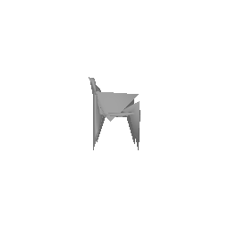

# Single View to 3D

## 1. Exploring loss functions
This section will involve defining a loss function, for fitting voxels, point clouds and meshes.

**Note: For all parts of this question right image is the prediction and left image is the ground truth**

### 1.1. Fitting a voxel grid

`Usage: python main.py --command q1.1` to fit the source voxel grid to the target voxel grid. 

|||
|:---:|:---:|

### 1.2. Fitting a point cloud

 `Usage: python main.py --command q1.2` to fit the source point cloud to the target point cloud.

|||
|:---:|:---:|

### 1.3. Fitting a mesh

`Usage: python main.py --command q1.3` to fit the source mesh to the target mesh. 

|||
|:---:|:---:|

## 2. Reconstructing 3D from single view 

**Note: For all parts of this question right image is the prediction and left image is the ground truth** 

### 2.1. Image to voxel grid
 `Usage: python main.py --command q2.1` to train and visualize the voxel grid 

#### Hyperparameters
`lr=4e-4 
batch_size=16 
max_iters=10000 
`

|| | |
|:---:|:------------------------------------------------:|:-------------------------------------------:|
||||
||||

### 2.2. Image to point cloud
 `Usage: python main.py --command q2.2` to train and visualize the point cloud

#### Hyperparameters

`lr=4e-4 
batch_size=16 
max_iters=10000 
`

||||
|:---:|:---:|:---:|
||||
||||

### 2.3. Image to mesh
 `Usage: python main.py --command q2.3` to train and visualize the mesh

#### Hyperparameters
`lr=4e-4
batch_size=16
max_iters=10000
w_smooth=0.3
w_chamfer=1.0`

||||
|:---:|:---:|:---:|
||||
||||

### 2.4. Quantitative comparisions

For evaluating you can run: 
 `Usage: python main.py --command q2.4` 

| Method | F1@0.05 | Avg F1@0.05 |
| --- | --- | --- |
|  Point Cloud  |  93.793  |  90.666  |
|  Mesh  |  96.428  |  89.353 |
|  Voxel  |  91.093  |  86.403  |

#### Observations:

It is easy to optimize points clouds as the model doesn't have to reason about connectivity. Simple chamfer loss-based supervision works well and 
the network can generalize over different types of chairs. Therefore, the point 
cloud model 
achieves a higher 
average F1 
score with the simplistic models that I have used in this assignment.
Generating meshes need stronger supervision as the model must reason about the connectivity between the vertices. Using only point-based chamfer 
loss will result in degenerate solutions. A shape regularizer such as laplacian smoothening helps generate more evenly-sized and smoother meshes.
Voxel-based model uses a heavier model using 3D convolutions in the decoder for connectivity and spatial reasoning. It is also slower to train than 
the point cloud 
and mesh models. Additionally,
it 
suffers from an implicit class-imbalance since the majority of the grid is unoccupied. Given that both, meshes and voxels must account for more 
than just the correct spatial position of vertices, they achieve lower average F1 scores. 
I also observed that some chairs were easier to render than the rest. I believe easy-to-render chairs such as the one shown below are closer to the 
prototypical (or the mean) chair in the distribution of the dataset and are also more abundantly present in the dataset. Both voxel and mesh 
models struggle to models holes in the object. 

### 2.5. Analyse effects of hyperparms variations

 `Usage: python main.py --command q2.5` 

#### Hyperparameters
`lr=4e-4
batch_size=16
max_iters=10000
w_chamfer=1.0`

I chose to vary 'w_smooth' and trained the mesh pipeline using the values [0.1, 0.3, 0.5]. I observed that the obtained results were best with a 
higher smoothening weight of 0.5. As expected, the meshes were less pointy and haphazard as I increased the laplacian smoothening regularization. 
However, I didn't observe drastic changes in the quality. I believe, using an even higher w_smooth or a different shape regularizer 
such as edge loss might result in smoother outputs. 

|||   |
|:---:|:---:|:---------------------------------------:|
| *w_smooth   =    0.1* |*w_smooth   =    0.3*|          *w_smooth   =    0.5*          |

||||
|:---:|:---:|:---:|
| *w_smooth   =    0.1* |*w_smooth   =    0.3*|*w_smooth   =    0.5*|

||||
|:---:|:---:|:---:|
| *w_smooth   =    0.1* |*w_smooth   =    0.3*|*w_smooth   =    0.5*|

| w_smooth | F1@0.05 | Avg F1@0.05 |
| --- | --- | --- |
|  0.1  |  96.428  |  89.353  |
|  0.3  |  96.138  |  90.732 |
|  0.5 |  97.134  |  91.811  |

### 2.6. Interpret your model

 `Usage: python main.py --command q2.6` 

To get more insight into what the network is learning, I have explored the latent space via latent space vector arithmetic. I first extract latent 
vectors 
corresponding to 
two different images using the point-cloud encoder and interpolate them to create a new latent. The interpolated latent vector, as evident from 
the visualization, still results in a semantically meaningful point cloud decoding. The intermediate outputs, infact, gradually change in appearance 
from the object in image 1 to the object in image 2 as the weight shifts from first latent to second. This provides evidence that the encoded latent 
space 
is semantically structured and this structure can be queried and navigated for our model. This is a desirable property and can be exploited to 
perform and can be exploited to identify meaningful directions in the latent space. 

|||
|:---:|:---:|
| *Image 1* |*Image 2*|

**Intermediate Outputs**

||| |
|:---:|:---:|:------------------------------------------------------------------:|
||||
||||

|||
|:---:|:---:|
| *Image 1* |*Image 2*|

**Intermediate Outputs**

||| |
|:---:|:---:|:------------------------------------------------------------------:|
||||
||||

### 3. Occupancy Networks

 `Usage: python main.py --command q3.1`  

I have implemented an occupancy network-inspired architecture which encodes a 3D point and an input image(of the same object) and then decodes them 
into an 
occupancy 
value. 
1. 5000 points are sampled from the 32 x 32 x 32 voxel grid and each point is encoded into a 512-d feature using a point encoder
2. The image is also encoded into a 512-d feature using an image encoder
3. The simple linear layer-based decoder receives a sum of the two encodings and decodes them into an occupancy value
4. The conditional Batch-Norm and Resnet-block based decoder decodes the point encoding into an occupancy value using conditional batch 
   normalization with the image encoding

|Options|Point Encoder| Image Encoder| Decoder|
|---|---|---|---|
| 1. |Linear layer based encoder with ReLU act| Simple Conv| Linear Layer based decoder with ReLU act|
| 2. |  |Resnet18 based encoder| Residual blocks with conditional batch-norm using image encoding |

### Visualizations 

Shown below are some results with the resnet encoder and cond-batch-norm-resnet decoder combination. 

Visualizations reveal thicker, more continuous rendering (example 1, 3, 4 below) for the implicit model compared to the previously used Image2Vox 
Model(Q2.1). Image2Vox
tries to learn a
sparser/leaner
representation and in the process often compromises on object continuity. On the other hand (second 
example below), with objects 
without holes, 
the 
Image2Vox does better. 

 

|||
|:---:|:---:|
| *Implicit* |*Image2Vox*|

 

|||
|:---:|:---:|
| *Implicit* |*Image2Vox*|

 

|||
|:---:|:---:|
| *Implicit* |*Image2Vox*|

 

|||
|:---:|:---:|
| *Implicit* |*Image2Vox*|

#### Hyperparameters

`lr=4e-4 
batch_size=32 
max_iters=5000 
`

**1. The implicit network is as follows:**

class ImplicitModel(nn.Module): 

    def __init__(self, n_points=5000, encoder_type="resnet18", decoder_type="simple"):
 
        super().__init__()
        self.n_points = n_points
        self.normalize = transforms.Normalize(mean=[0.485, 0.456, 0.406], std=[0.229, 0.224, 0.225])
        self.img_encoder = None
        self.decoder = None
        self.decoder_type = decoder_type

        # initialize image encoder
        if encoder_type == "resnet18":
            self.img_encoder = ResnetEncoder()
        elif encoder_type == "conv":
            self.img_encoder = ConvEncoder()

        # initialize point encoder
        self.point_encoder = PointEncoder(in_features=3)

        # initialize decoder
        if decoder_type == "cbn_decoder":
            self.decoder = CBNDecoder(n_points=self.n_points)
        elif decoder_type == "simple":
            self.decoder = nn.Sequential(
                nn.Linear(in_features=512, out_features=256),
                nn.PReLU(),
                nn.Linear(in_features=256, out_features=128),
                nn.PReLU(),
                nn.Linear(in_features=128, out_features=1),
            )

    def forward(self, pts, images): 

        images = images.permute(0, 3, 1, 2)
        img_encoding = self.img_encoder(images)  # n_batch x 512
        point_encoding = self.point_encoder(pts)  # (n_batch * n_points) x 512

        n_batch = img_encoding.shape[0]
        n_points = point_encoding.shape[0] // n_batch
        img_encoding = img_encoding.repeat_interleave(n_points, dim=0)  # (n_batch * n_points) x 512

        if self.decoder_type == "simple":
            comb_encoding = img_encoding + point_encoding
            return self.decoder(comb_encoding).reshape((n_batch, n_points, 1))  # (n_batch, n_points, 3)

        elif self.decoder_type == "cbn_decoder":
            return self.decoder(point_encoding, img_encoding).reshape(n_batch, n_points, 1)
        return None

**2. The point encoder submodule is as follows:** 

class PointEncoder(nn.Module): 

    def __init__(self, in_features=3, features_d=64):

        super().__init__()
        self.encoder = nn.Sequential(
            nn.Linear(in_features=in_features, out_features=features_d),
            nn.ReLU(),
            nn.Linear(in_features=features_d, out_features=features_d * 2),
            nn.ReLU(),
            nn.Linear(in_features=features_d * 2, out_features=features_d * 4),
            nn.ReLU(),
            nn.Linear(in_features=features_d * 4, out_features=features_d * 8),
            nn.ReLU(),
        )

    def forward(self, x):

        x = x.reshape((-1, 3))
        return self.encoder(x)

**3. The image encoder submodule is as follows:** 

class ConvEncoder(nn.Module): 

    def __init__(self, in_channels=3, hidden_dim=64):

        super().__init__()
        self.encoder = nn.Sequential(
            self._convBlock(in_channels, hidden_dim, 4, 2, 1),
            self._convBlock(hidden_dim, hidden_dim * 2, 4, 2, 1),
            self._convBlock(hidden_dim * 2, hidden_dim * 4, 4, 2, 1),
            self._convBlock(hidden_dim * 4, hidden_dim * 8, 4, 2, 1),
            nn.AdaptiveAvgPool2d(output_size=(1, 1))
        )

        self.normalize = T.Normalize(mean=[0.485, 0.456, 0.406], std=[0.229, 0.224, 0.225])

    def _convBlock(self, in_channels, out_channels, kernel_size=4, stride=2, padding=1):

        return nn.Sequential(
            nn.Conv2d(in_channels=in_channels, out_channels=out_channels, kernel_size=kernel_size, stride=stride, padding=padding, bias=False),
            nn.ReLU(),
            nn.BatchNorm2d(num_features=out_channels)
        )

    def forward(self, x):

        images_normalize = self.normalize(x)
        out = self.encoder(images_normalize)
        out = out.reshape((out.shape[0], -1))
        return out

class ResnetEncoder(nn.Module): 

    def __init__(self):

        super().__init__()
        vision_model = torchvision_models.resnet18(pretrained=True)
        self.encoder = torch.nn.Sequential(*(list(vision_model.children())[:-1]))
        self.normalize = T.Normalize(mean=[0.485, 0.456, 0.406], std=[0.229, 0.224, 0.225])

    def forward(self, x):

        images_normalize = self.normalize(x)
        out = self.encoder(images_normalize)
        out = out.reshape((out.shape[0], -1))
        return out

**4. The decoder submodule is as follows:**

class CBNDecoder(nn.Module): 

    def __init__(self, in_features=512, hidden_dim=512, img_encoding_dim=512, n_points=100):
        super().__init__()
        self.resnetCBNBlock = ResnetCBNBlock(in_features, hidden_dim, img_encoding_dim)
        self.linear = nn.Linear(hidden_dim, 1)

    def forward(self, point_encoding, img_encoding, num_resnet_blocks=3):

        n_batch = img_encoding.shape[0]
        n_points = point_encoding.shape[0]//n_batch
        img_encoding = img_encoding.repeat_interleave(n_points, dim=0)
        out = point_encoding
        for i in range(num_resnet_blocks):
            out = self.resnetCBNBlock(out, img_encoding)
        return self.linear(out)

class ResnetCBNBlock(nn.Module):

    def __init__(self, in_features=512, out_features=512, img_encoding_dim=512):

        super().__init__()
        self.skip = nn.Identity()
        if in_features != out_features:
            self.skip = nn.Conv1d(in_features, out_features, kernel_size=1, bias=False)
        self.cond_batch_norm = CondBatchNorm(out_features, img_encoding_dim)
        self.linear = nn.Sequential(
            nn.ReLU(),
            nn.Linear(in_features=in_features, out_features=out_features)
        )

    def forward(self, point_encoding, img_encoding):

        residual = self.linear(self.cond_batch_norm(point_encoding, img_encoding))
        residual = self.linear(self.cond_batch_norm(residual, img_encoding))
        return self.skip(point_encoding.unsqueeze(-1)).squeeze() + residual

class CondBatchNorm(nn.Module):

    def __init__(self, img_encoding_dim=512, out_features=512):

        super().__init__()
        self.conv_gamma = nn.Conv1d(img_encoding_dim, out_features, kernel_size=1)
        self.conv_beta = nn.Conv1d(img_encoding_dim, out_features, kernel_size=1)
        self.bn = nn.BatchNorm1d(out_features, affine=False)

    def forward(self, point_encoding, img_encoding):

        img_encoding = img_encoding.unsqueeze(-1)
        gamma = self.conv_gamma(img_encoding).squeeze(-1)
        beta = self.conv_beta(img_encoding).squeeze(-1)
        net = self.bn(point_encoding)
        return gamma * net + beta`
